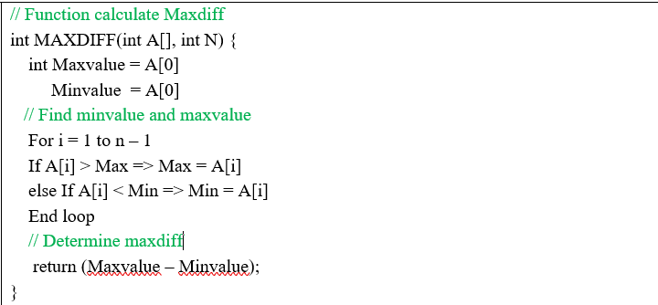
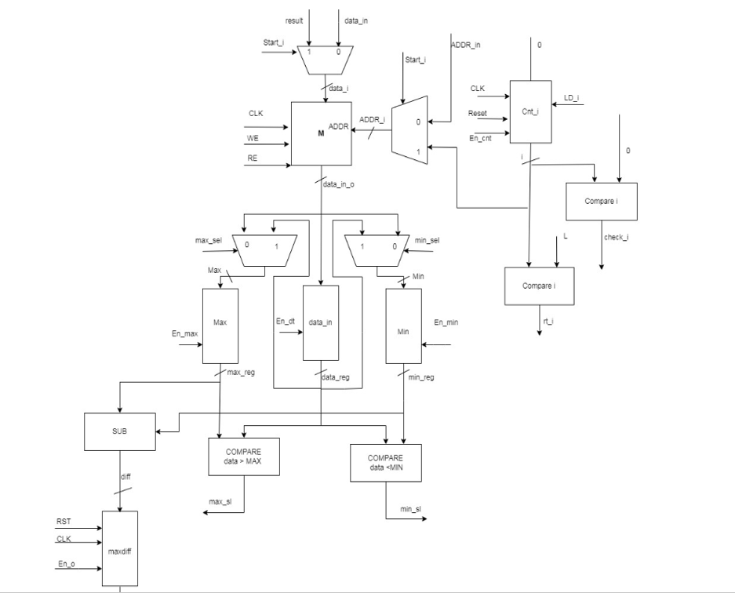
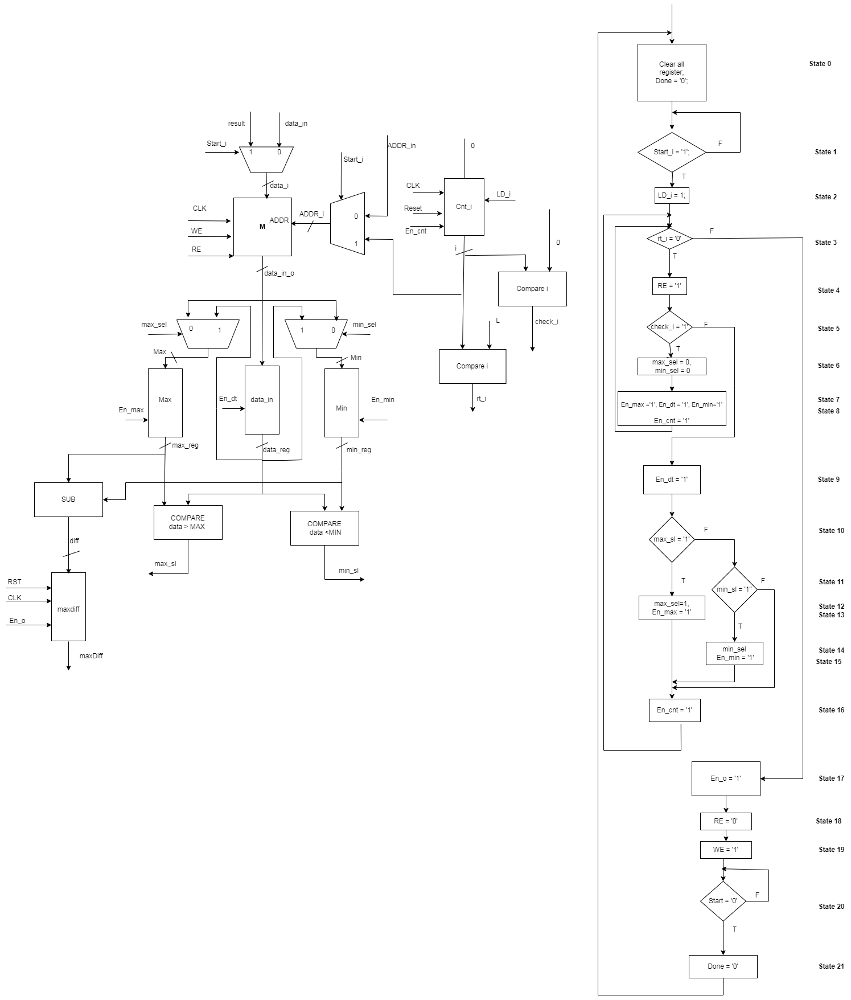

# MAXDIFF

## INTRODUCTION
*  This project is final project of Digital Design Courses (ELT3202), UET-VNU.
* This project is designed at RTL level, and it used VHDL to describe Hardware and Modelsim to simulate the results.

## ABOUT PROJECT
### Algorithms
First, this project use a for loop to find the number which has the biggest value and a number with the smallest value.
In the last step, we just need subtract them from each other.



### INOUT signal
``` 
| TT  | Port   | Direction | Width   | Meaning                                    |
|----:|:-------|:----------|:--------|:-------------------------------------------|
| 1   | Data_i | in        | 8 bit   | Input singal                               |
| 2   | Data_o | out       | 8 bit   | Output signal                              |
| 3   | RST    | in        | 1 bit   | Reset signal                               |
| 4   | CLK    | in        | 1 bit   | CLock pulse                                |
| 5   | Done   | out       | 1 bit   | Complete signal                            |
| 6   | Start  | in        | 1 bit   | Begin signal             |
| 7   | WE     | in        | 1 bit   | Signal which accept writing data in MEMORY |
| 8   | RE     | in        | 1 bit   | Signal which accept read data in MEMORY    |
```


### Datapath
This is datapath of this system

### Full system diagram
 

## USES
This project is as an material study.

